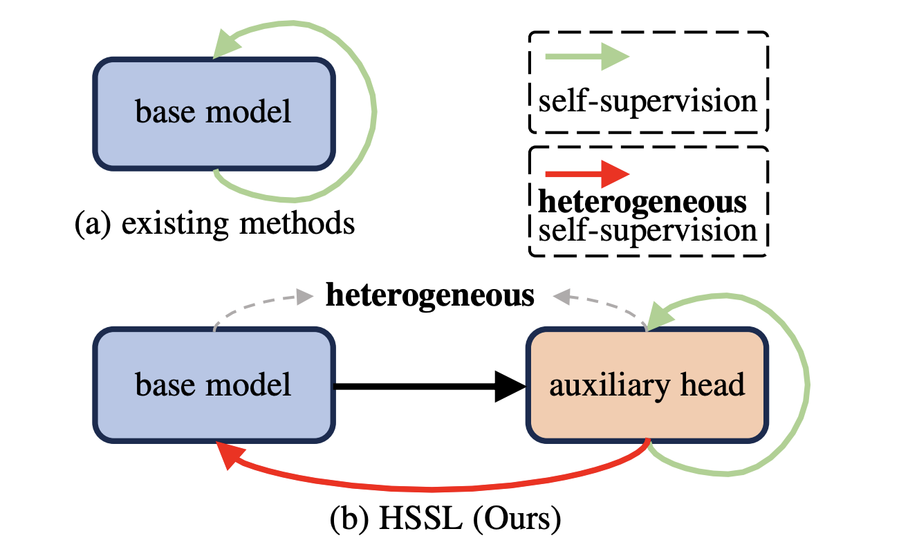

# Enhancing Representations through Heterogeneous Self-Supervised Learning ([TPAMI 2025](https://ieeexplore.ieee.org/document/10955443))

The jittor codebase for [Enhancing Representations through Heterogeneous Self-Supervised Learning](https://arxiv.org/abs/2310.05108).

[[Pytorch codebase](https://github.com/lzyhha/HSSL)]


## Introduction

<div align="center">
  
</div>

Incorporating heterogeneous representations from different architectures has facilitated various vision tasks, e.g., some hybrid networks combine transformers and convolutions. However, complementarity between such heterogeneous architectures has not been well exploited in self-supervised learning. Thus, we propose Heterogeneous Self-Supervised Learning (HSSL), which enforces a base model to learn from an auxiliary head whose architecture is heterogeneous from the base model. In this process, HSSL endows the base model with new characteristics in a representation learning way without structural changes. To comprehensively understand the HSSL, we conduct experiments on various heterogeneous pairs containing a base model and an auxiliary head. We discover that the representation quality of the base model moves up as their architecture discrepancy grows. This observation motivates us to propose a search strategy that quickly determines the most suitable auxiliary head for a specific base model to learn and several simple but effective methods to enlarge the model discrepancy. The HSSL is compatible with various self-supervised methods, achieving superior performances on various downstream tasks, including image classification, semantic segmentation, instance segmentation, and object detection.

## Installation
Please install [Jittor](https://cg.cs.tsinghua.edu.cn/jittor/download/) and download the [ImageNet](https://imagenet.stanford.edu/) dataset. 

## Training and Pre-trained Models

```shell
python main_hssl.py \
--arch vit_base \
--auxiliary_depth 3 \
--output_dir $OUTPUT_DIR \
--data_path $IMAGENET \
--teacher_temp 0.07 \
--teacher_patch_temp 0.07 \
--warmup_teacher_temp 0.04 \
--warmup_teacher_patch_temp 0.04 \
--warmup_teacher_temp_epochs 50 \
--norm_last_layer true \
--warmup_epochs 10 \
--epochs 100 \
--lr 0.00075 \
--min_lr 2e-6 \
--weight_decay 0.04 \
--weight_decay_end 0.4 \
--shared_head true \
--shared_head_teacher true \
--out_dim 8192 \
--patch_out_dim 8192 \
--global_crops_scale 0.14 1 \
--pred_ratio 0 0.3 \
--pred_ratio_var 0 0.2 \
--pred_shape block \
--batch_size 256 \
--num_workers 6 \
--saveckp_freq 10 \
--freeze_last_layer 3 \
--accum_iter 1 --clip_grad 0.3
```


## Citing HSSL
If you find this repository useful, please consider giving a star and a citation:
```
@article{li2025hssl,
  title={Enhancing Representations through Heterogeneous Self-Supervised Learning}, 
  author={Li, Zhong-Yu and Yin, Bo-Wen and Liu, Yongxiang and Liu, Li and Cheng, Ming-Ming},
  journal=TPAMI,
  year={2025}
}
```

## Acknowledgement

This repository is built using the [DINO](https://github.com/facebookresearch/dino) repository, the [iBOT](https://github.com/bytedance/ibot) repository, 
and the [MAE](https://github.com/facebookresearch/mae) repository.
