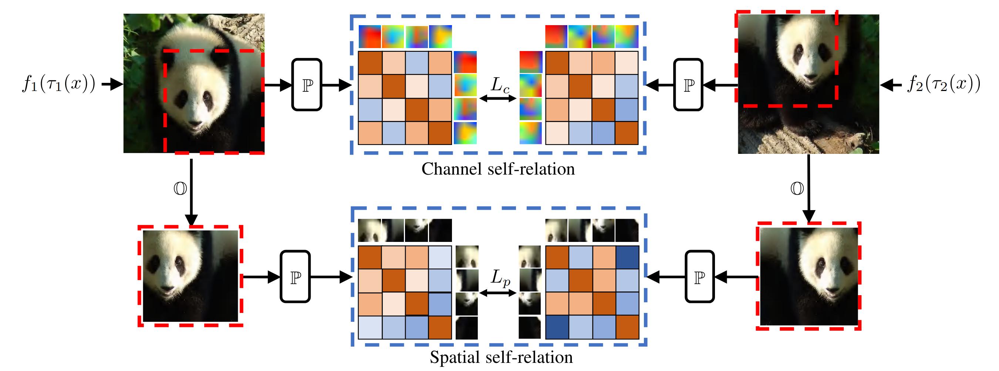

# SERE: Exploring Feature Self-relation for Self-supervised Transformer ([TPAMI 2023](https://ieeexplore.ieee.org/document/10234504))

The jittor codebase for [SERE: Exploring Feature Self-relation for Self-supervised Transformer](https://arxiv.org/abs/2206.05184).

[[Pytorch codebase](https://github.com/MCG-NKU/SERE)]

## Introduction

<div align="center">
  
</div>

Learning representations with self-supervision for convolutional networks (CNN) has been validated to be effective for vision tasks. As an alternative to CNN, vision transformers (ViT) have strong representation ability with spatial self-attention and channel-level feedforward networks. Recent works reveal that self-supervised learning helps unleash the great potential of ViT. Still, most works follow self-supervised strategies designed for CNN, e.g., instance-level discrimination of samples, but they ignore the properties of ViT. We observe that relational modeling on spatial and channel dimensions distinguishes ViT from other networks. To enforce this property, we explore the feature SElf-RElation (SERE) for training self-supervised ViT. Specifically, instead of conducting self-supervised learning solely on feature embeddings from multiple views, we utilize the feature self-relations, i.e., spatial/channel self-relations, for self-supervised learning. Self-relation based learning further enhances the relation modeling ability of ViT, resulting in stronger representations that stably improve performance on multiple downstream tasks. 

## Installation
Please install [Jittor](https://cg.cs.tsinghua.edu.cn/jittor/download/) and download the [ImageNet](https://imagenet.stanford.edu/) dataset. 

## Training

```shell
python main_sere.py \
--arch vit_small \
--output_dir $OUTPUT_DIR \
--data_path $IMAGENET \
--teacher_temp 0.07 \
--warmup_teacher_temp_epochs 30 \
--norm_last_layer false \
--epochs 100 \
--shared_head true \
--out_dim 8192 \
--global_crops_scale 0.14 1 \
--pred_ratio 0 0.3 \
--pred_ratio_var 0 0.2 \
--batch_size 1024 \
--num_workers 6 \
--saveckp_freq 10 \
--alpha 0.2 \
--beta 0.5 \
--clip_grad 0.3
```


## Citing SERE
If you find this repository useful, please consider giving a star and a citation:
```
@article{li2023sere,
  title={SERE: Exploring Feature Self-relation for Self-supervised Transformer},
  author={Zhong-Yu Li and Shanghua Gao and Ming-Ming Cheng},
  journal=TPAMI,
  year={2023}
}
```

## Acknowledgement

This repository is built using the [DINO](https://github.com/facebookresearch/dino) repository, the [iBOT](https://github.com/bytedance/ibot) repository, 
and the [MAE](https://github.com/facebookresearch/mae) repository.
